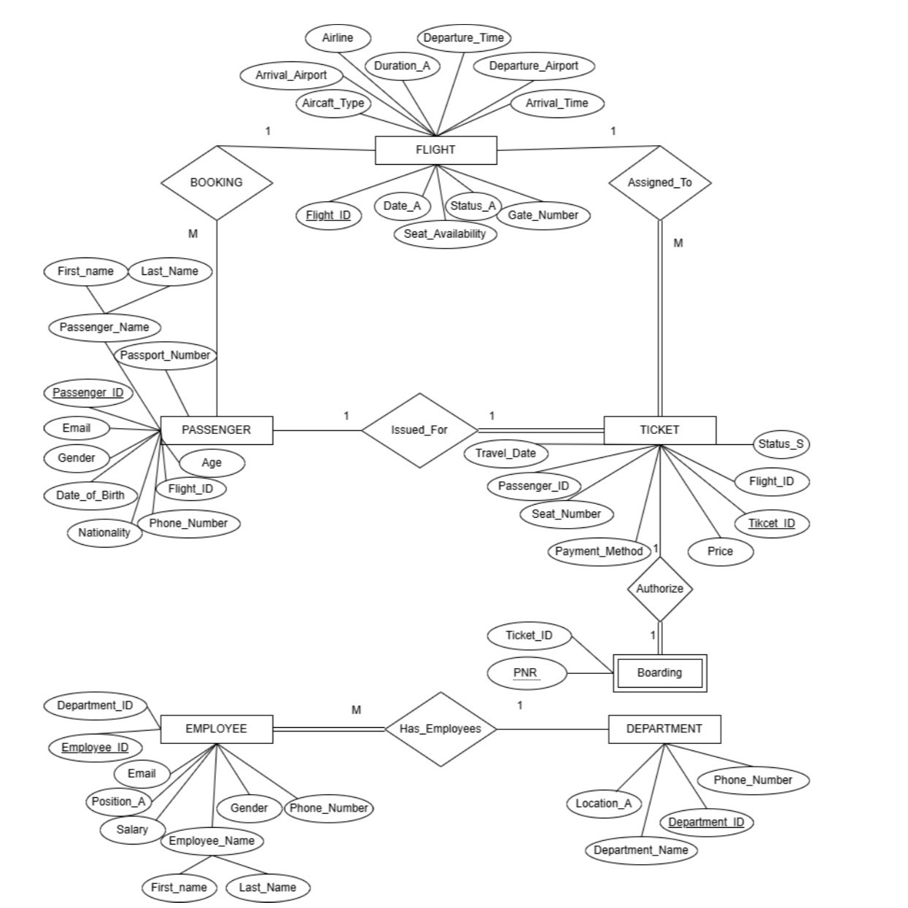
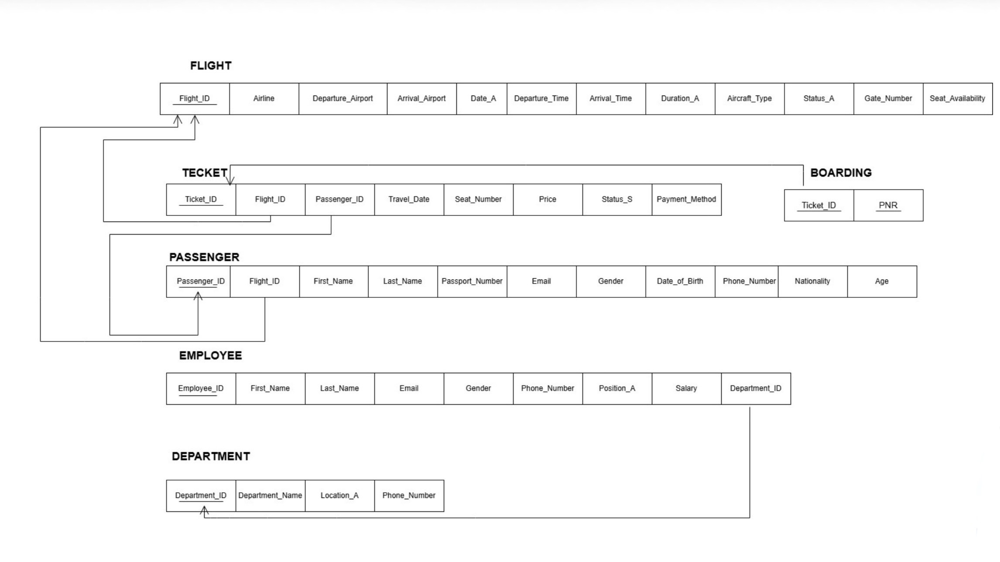

# Airport-SQL-Database-System

A relational database system developed using Oracle SQL and PL/SQL to manage airport operations. The project demonstrates database design, normalization, relational modeling, constraints, triggers, and SQL querying through a realistic airport management scenario.

## Features

- Flight Management
- Passenger Management
- Ticket Management
- Boarding Records
- Employee & Department Management
- Data Integrity using Primary & Foreign Keys
- Constraints and Trigger Implementation

## Technologies

- Oracle Database
- SQL
- PL/SQL

## Database Schema

The database consists of the following tables:

- FLIGHT
- PASSENGER
- TICKET
- EMPLOYEE
- DEPARTMENT
- BOARDING

## Project Structure

```
Airport-Database-System/
│
├── README.md
├── Database.sql
├── Insert_Data.sql
├── Queries.sql
├── Trigger.sql
├── ERD.png
└── Relational_Model.png
```

## Getting Started

1. Execute `Database.sql`
2. Execute `Insert_Data.sql`
3. Execute `Trigger.sql`
4. Run any query from `Queries.sql`

## Entity Relationship Diagram



## Relational Model


